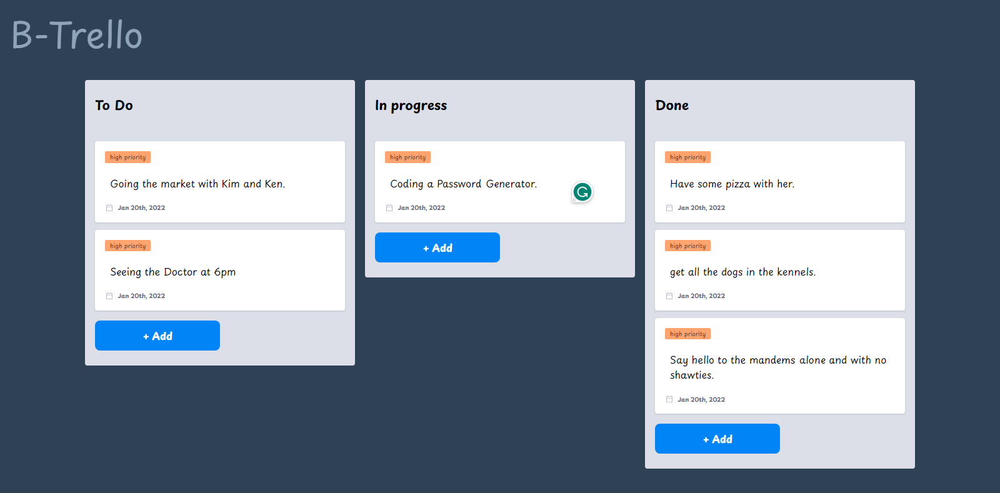

## Trello board Project 
### Project Overview
Trello-board project is a simple project that helps a user to display to-do tasks in an organized way where the user is also able to drag and drop to-dos in whatever tire according to the state of the to-do. 

## Tech Stack
The project is built with vanilla JavaScript.

## Screenshots
### Desktop View

## Link
 - Live Site:[Live Site](https://devjhex-btrello.netlify.app/) 